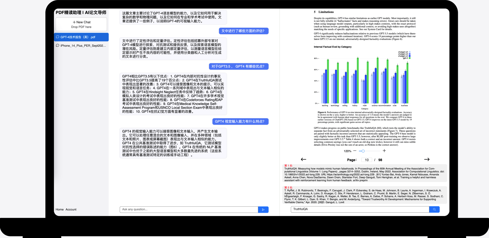

[English](./README_EN.md)
## ChatPDF

ChatPDF 是一个开源项目，你可以在部署此项目后，通过私有 openai key，自由地与 PDF 对话。下面是一些经典使用场景：

1. 总结和分析论文、学术文章。
2. 报告总结、分析和针对细节的提问。
3. 回答任何 PDF 中的任何问题。

## 技术栈

- 前端：React + Antd + tailwindCSS
- 后端：Python + FastAPI + MySQL + Redis(optional)
- AI: langchain + llama_index

## 特性

- 流式传输
- 注册登录
- 会话次数限制
- 国际化支持

## 部署注意

项目开发之初并非为开源设计，对于没有相关技术栈经验的人员部署此项目，可能需要花费些时间。后续会优化代码和部署流程，并书写详细部署指南。
